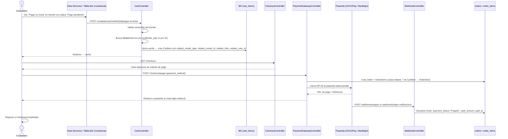

# Módulo de Cobros en Línea

Sistema de pagos en línea para trámites municipales. Permite a los ciudadanos pagar servicios vinculados a sus trámites (constancias, licencias, etc.) a través de OXXOPay o BanBajío.

---

## Regla fundamental: 1 servicio = 1 orden = 1 trámite

El carrito solo puede contener **un ítem a la vez**. Antes de agregar un nuevo servicio se vacía el carrito. Esto simplifica la vinculación polimórfica: cada orden queda ligada a exactamente un documento/trámite.

---

## Flujo completo



---

## Base de datos

### `billable_services` — Catálogo de servicios cobrables

| Columna       | Tipo           | Descripción                                      |
|---------------|----------------|--------------------------------------------------|
| `id`          | bigint PK      |                                                  |
| `name`        | string         | **Debe coincidir con `certificate_type`** del trámite |
| `description` | text nullable  |                                                  |
| `unit_price`  | decimal(8,2)   |                                                  |
| `is_active`   | boolean        | Solo los activos aparecen en la tienda           |

### `carts` — Un carrito por usuario (1:1)

| Columna   | Tipo      |
|-----------|-----------|
| `user_id` | FK unique |

### `cart_items` — Ítem en carrito con vinculación polimórfica

| Columna               | Tipo              | Descripción                                          |
|-----------------------|-------------------|------------------------------------------------------|
| `cart_id`             | FK                |                                                      |
| `billable_service_id` | FK                |                                                      |
| `quantity`            | int               | Siempre 1 por la regla de 1 documento por orden      |
| `related_model_type`  | string nullable   | FQCN del modelo relacionado (ej. `App\Models\IdentificationCertificate`) |
| `related_model_id`    | bigint nullable   | ID del registro relacionado                          |
| `related_folio`       | string nullable   | Folio del trámite (snapshot)                         |
| `related_user_id`     | bigint nullable   | ID del ciudadano dueño del trámite                   |

### `orders` — Orden de cobro

| Columna              | Tipo     | Valores posibles                                  |
|----------------------|----------|---------------------------------------------------|
| `user_id`            | FK       |                                                   |
| `folio`              | string   | Generado automáticamente (10 chars uppercase)     |
| `total`              | decimal  |                                                   |
| `payment_method`     | string   | `oxxopay` \| `banbajio`                          |
| `payment_status`     | string   | `Pago Pendiente` \| `Referencia Expirada` \| `Pagado` |
| `delivery_status`    | string   | `Pendiente` \| `Entregado` \| `Cancelado`         |
| `payment_id`         | string   | ID de la orden en la pasarela                     |
| `payment_reference`  | string   | Referencia de pago (OXXO / BanBajío)             |
| `payment_url`        | string   | URL de pago en pasarela (OXXO)                    |
| `paid_at`            | datetime |                                                   |
| `paid_amount`        | decimal  |                                                   |
| `delivered_at`       | datetime |                                                   |
| `cancelled_at`       | datetime |                                                   |
| `admin_note`         | text     |                                                   |

### `order_items` — Ítem de orden (snapshot inmutable)

| Columna               | Tipo            | Descripción                                          |
|-----------------------|-----------------|------------------------------------------------------|
| `order_id`            | FK              |                                                      |
| `billable_service_id` | FK nullable     | nullOnDelete — histórico se conserva                 |
| `service_name`        | string          | Snapshot del nombre al momento del pago              |
| `unit_price`          | decimal(8,2)    | Snapshot del precio                                  |
| `quantity`            | int             |                                                      |
| `subtotal`            | decimal         |                                                      |
| `related_model_type`  | string nullable | Copiado desde `cart_items`                           |
| `related_model_id`    | bigint nullable | Copiado desde `cart_items`                           |
| `related_folio`       | string nullable | Copiado desde `cart_items`                           |
| `related_user_id`     | bigint nullable | Copiado desde `cart_items`                           |

---

## Archivos del módulo

### Controladores

| Archivo | Responsabilidad |
|---------|----------------|
| `app/Http/Controllers/Front/CartController.php` | Gestión del carrito. `addCertificateToCart()` es el método canónico para vincular un trámite al carrito. |
| `app/Http/Controllers/Front/PaymentGatewayController.php` | Crea `Order` + `OrderItems`, llama a la pasarela de pago. Aquí se copian los campos `related_*` de `CartItem` → `OrderItem`. |
| `app/Http/Controllers/Front/CheckoutController.php` | Muestra selección de método de pago y páginas de resultado (éxito/fallido). |
| `app/Http/Controllers/Front/OrderController.php` | Lista y detalle de órdenes del ciudadano. Genera recibo PDF. |
| `app/Http/Controllers/Front/WebhookController.php` | Recibe notificaciones de OXXOPay y BanBajío. Actualiza `payment_status`, `paid_amount`, `paid_at`. |
| `app/Http/Controllers/Front/ServicesController.php` | Vista del catálogo de servicios (`billable_services`). |

### Modelos

| Archivo | Relaciones clave |
|---------|-----------------|
| `app/Models/BillableService.php` | `hasMany CartItem`, `hasMany OrderItem` |
| `app/Models/Cart.php` | `belongsTo User`, `hasMany CartItem` |
| `app/Models/CartItem.php` | `belongsTo Cart`, `belongsTo BillableService` |
| `app/Models/Order.php` | `belongsTo User`, `hasMany OrderItem`. `generateFolio()` static. |
| `app/Models/OrderItem.php` | `belongsTo Order`, `belongsTo BillableService` |

### Vistas

| Archivo | Descripción |
|---------|-------------|
| `resources/views/front/services/index.blade.php` | Catálogo de servicios + modal para vincular folio |
| `resources/views/front/checkout/cart.blade.php` | Vista del carrito |
| `resources/views/front/checkout/index.blade.php` | Selección de método de pago |
| `resources/views/front/checkout/success.blade.php` | Confirmación post-pago. Muestra `related_folio` y modelo. |
| `resources/views/front/checkout/failed.blade.php` | Pago fallido |
| `resources/views/front/orders/index.blade.php` | Historial de órdenes del ciudadano |
| `resources/views/front/orders/show.blade.php` | Detalle de orden ciudadano. Muestra `related_folio`. |
| `resources/views/front/orders/receipt.blade.php` | Recibo PDF descargable |
| `resources/views/backoffice/orders/index.blade.php` | Listado admin de órdenes |
| `resources/views/backoffice/orders/show.blade.php` | Detalle admin. Muestra `related_folio`, modelo. Permite actualizar `delivery_status` y agregar nota. |

### Livewire

| Componente | Descripción |
|------------|-------------|
| `app/Livewire/IdentificationCertificates/Table.php` | Tabla admin/ciudadano. En modo ciudadano (`mode=1`) muestra botón **"Pagar en línea"** cuando `status === 'Pago pendiente'`. |

### Rutas relevantes (`routes/web.php`)

```php
// Catálogo de servicios
Route::get('/servicios', ...)                                      // citizen.services.index

// Carrito
Route::get('/carrito', ...)                                        // citizen.cart.index
Route::post('/carrito/agregar', ...)                               // citizen.cart.store
Route::patch('/carrito/items/{cartItem}', ...)                     // citizen.cart.update
Route::delete('/carrito/items/{cartItem}', ...)                    // citizen.cart.destroy

// Vinculación desde módulo Constancias de Identificación
Route::post('/constancias_de_identificacion/{id}/pagar-en-linea', 'CartController@addCertificateToCart')
    ->name('citizen.identification_certificate.pay_online');

// Checkout
Route::get('/checkout', ...)                                       // citizen.checkout.index
Route::post('/checkout/pagar', ...)                                // citizen.checkout.pay

// Páginas de resultado
Route::get('/checkout/completado', ...)                            // oxxopay.complete / bajiopay.complete
Route::get('/checkout/fallido', ...)                               // oxxopay.failed / bajiopay.failed

// Órdenes ciudadano
Route::get('/mis-ordenes', ...)                                    // citizen.orders.index
Route::get('/mis-ordenes/{order}', ...)                            // citizen.orders.show
Route::get('/mis-ordenes/{order}/recibo', ...)                     // citizen.orders.receipt

// Webhooks (sin middleware auth)
Route::post('/webhooks/pagos', ...)                                // webhook.payments
Route::post('/webhooks/bajio-notificacion', ...)                   // webhook.bajio

// Admin
Route::get('ordenes', ...)                                         // admin.orders.index
Route::get('ordenes/{order}', ...)                                 // admin.orders.show
Route::patch('ordenes/{order}/status', ...)                        // admin.orders.update_status
Route::patch('ordenes/{order}/nota', ...)                          // admin.orders.update_note
```

### Migraciones relacionadas

| Archivo | Qué crea/modifica |
|---------|------------------|
| `..._create_billable_services_table.php` | Tabla de servicios cobrables |
| `..._create_carts_table.php` | Tabla de carritos |
| `..._create_cart_items_table.php` | Items del carrito |
| `..._create_orders_table.php` | Órdenes de cobro |
| `..._create_order_items_table.php` | Items de orden (snapshot) |
| `..._add_chronology_columns_to_orders_table.php` | `delivered_at`, `cancelled_at`, `admin_note` |
| `..._add_related_columns_to_cart_items_table.php` | `related_model_type/id/folio/user_id` en `cart_items` |
| `..._add_related_columns_to_order_items_table.php` | `related_model_type/id/folio/user_id` en `order_items` |

---

## Cómo extender el módulo a un nuevo trámite

El patrón a seguir se puede ver en `CartController::addCertificateToCart()` para constancias de identificación. Los pasos son siempre los mismos.

### Paso 1 — Crear el `BillableService`

Desde el panel admin en **Tesorería → Servicios**, crear un nuevo servicio con el nombre **exactamente igual** al valor que aparecerá en el campo tipo del nuevo trámite (p. ej. `"Licencia de Construcción"`). El sistema buscará el servicio por ese nombre.

### Paso 2 — Agregar la ruta

En `routes/web.php`, dentro del grupo de ciudadanos:

```php
Route::post('/nuevo-modulo/{id}/pagar-en-linea', 'CartController@addNuevoModuloToCart')
    ->name('citizen.nuevo_modulo.pay_online');
```

### Paso 3 — Crear el método en `CartController`

```php
public function addNuevoModuloToCart(Request $request, int $id)
{
    // 1. Cargar el trámite y verificar que pertenezca al usuario autenticado
    $tramite = NuevoModelo::where('id', $id)
        ->where('user_id', Auth::id())
        ->firstOrFail();

    // 2. Validar que el trámite esté en un estado pagable
    if ($tramite->status !== 'Pago pendiente') {
        return redirect()->back()
            ->with('error', 'Solo se pueden pagar trámites con estatus "Pago pendiente".');
    }

    // 3. Buscar el BillableService por nombre (igual al tipo del trámite)
    $service = BillableService::where('name', $tramite->tipo) // ajustar campo
        ->where('is_active', true)
        ->first();

    if (!$service) {
        return redirect()->back()
            ->with('error', 'No hay un servicio de pago activo para este trámite. Contacta a soporte.');
    }

    // 4. Vaciar el carrito (1 documento por orden)
    $cart = $this->getOrCreateCart();
    $cart->items()->delete();

    // 5. Agregar el ítem vinculando el trámite
    $cart->items()->create([
        'billable_service_id' => $service->id,
        'quantity'            => 1,
        'related_model_type'  => NuevoModelo::class,  // FQCN completo
        'related_model_id'    => $tramite->id,
        'related_folio'       => $tramite->folio,
        'related_user_id'     => $tramite->user_id,
    ]);

    return redirect()->route('citizen.cart.index')
        ->with('success', 'Trámite "' . $tramite->folio . '" agregado al carrito. Procede al pago.');
}
```

> No se requiere tocar `PaymentGatewayController`, `CheckoutController`, ni las vistas de orden. El sistema propaga automáticamente los campos `related_*` al crear los `OrderItems`.

### Paso 4 — Agregar el botón en la vista del módulo

En la tabla o vista de listado del nuevo módulo (Livewire o Blade), agregar el botón cuando el trámite esté en estado pagable:

```blade
@if ($tramite->status === 'Pago pendiente')
    <form action="{{ route('citizen.nuevo_modulo.pay_online', $tramite->id) }}"
          method="POST" class="d-inline ms-1">
        @csrf
        <button type="submit" class="btn btn-sm btn-success">
            <ion-icon name="card-outline"></ion-icon> Pagar en línea
        </button>
    </form>
@endif
```

### Paso 5 — (Opcional) Agregar la sección en "Mis Solicitudes"

En `resources/views/front/user_profiles/citizen/my_requests.blade.php`, agregar un nuevo `@case` para el módulo con el botón que lleve al listado correspondiente.

---

## Pasarelas de pago

### OXXOPay (DigitalFemsa)

- SDK: `digitalfemsa/digitalfemsa-php` vía Composer
- Flujo: Crear cliente → Crear orden en API → Redirigir a `checkout.url`
- Webhook: `POST /webhooks/pagos` — valida el evento `order.paid`
- Retorno: `route('oxxopay.complete')` / `route('oxxopay.failed')`
- Config: `config/services.php` → `femsa.private_key`

### BanBajío (Multipagos)

- Sin SDK. Firma RSA/SHA-512 sobre la cadena `cl_folio|cl_referencia|dl_monto|cl_concepto|servicio|`
- Flujo: Crear orden en BD → Firmar → Auto-submit form POST a `multipagos_url`
- Webhook: `POST /webhooks/bajio-notificacion`
- Retorno: `route('bajiopay.complete')` / `route('bajiopay.failed')`
- Config: `config/services.php` → `bajio.*`, llave privada en `storage/keys/bajio/private_key.pem`

### `test_payment` (solo `APP_ENV=local`)

- Crea la orden directamente con `payment_status = 'Pagado'` sin llamar a ninguna pasarela.
- Útil para probar el flujo completo en local.

---

## Flujo de administración

El equipo de tesorería gestiona las órdenes desde **Intranet → Tesorería → Cobros en Línea**:

1. **Listado** (`admin.orders.index`): filtros por estado de pago, fecha, folio y ciudadano.
2. **Detalle** (`admin.orders.show`): muestra el servicio contratado, el trámite vinculado (`related_folio` + nombre del modelo), los datos del ciudadano, la referencia de pago y el historial de estados.
3. **Actualizar entrega**: el admin puede cambiar `delivery_status` a `Entregado` o `Cancelado` una vez procesado el trámite.
4. **Nota interna**: campo libre para anotaciones internas (`admin_note`).

---

## Notas de diseño

- Los campos `related_*` en `order_items` son **snapshots**. No se usan foreign keys con `constrained()` para evitar que la eliminación de registros en otros módulos rompa el historial de órdenes.
- `class_basename($item->related_model_type)` se usa en las vistas para mostrar el nombre legible del modelo (ej. `IdentificationCertificate`) sin exponer el namespace completo.
- `IdentificationCertificatePayment` es el sistema **legacy de pagos manuales** (captura de comprobante físico). Sigue en uso para el flujo interno del backoffice pero es independiente de este módulo de cobros en línea.
